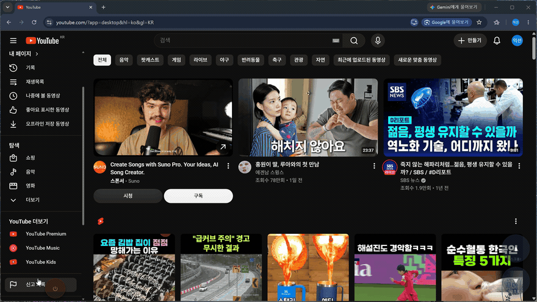
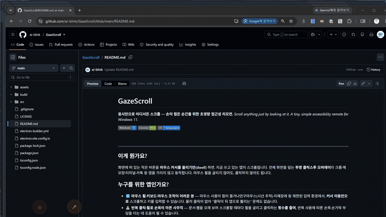
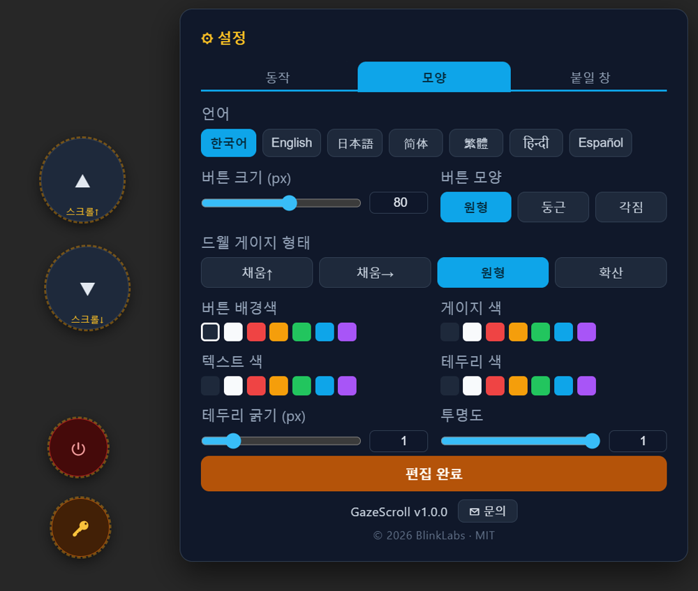
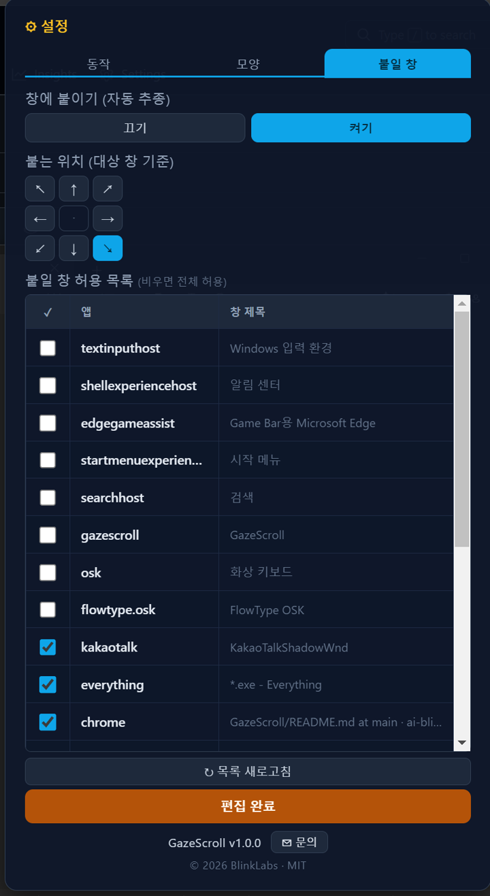

# GazeScroll

**응시만으로 어디서든 스크롤 — 손이 힘든 순간을 위한 초경량 접근성 리모컨.**
_Scroll anything just by looking at it. A tiny, simple accessibility remote for Windows 11._

  

<!-- 데모 이미지는 assets/ 에 넣으면 표시됩니다(파일명은 assets/README.md 참고) -->


---

## 이게 뭔가요?

화면에 떠 있는 작은 버튼을 **마우스 커서를 올리기만(dwell)** 하면, 지금 쓰고 있는 앱이 스크롤됩니다.
전체 화면을 덮는 **투명 클릭스루 오버레이**라 크롬·메모장·터미널·카톡 등 앱을 가리지 않고 동작합니다.
마우스 휠을 굴리지 않아도, 클릭하지 않아도 됩니다.

## 누구를 위한 앱인가요?

- ♿ **마우스 휠·키보드·마우스 조작이 어려운 분** — 마우스 사용이 힘들거나, 안구마우스(시선 추적)·지체장애 등 제한된 입력 환경에서, **커서 이동만으로** 스크롤하고 키를 입력할 수 있습니다. 물리 클릭이 없어 "클릭이 뒤 앱으로 뚫리는" 문제도 없습니다.
- 🧑‍💻 **반복 클릭·휠로 손목이 아픈 사무직** — 문서·웹을 오래 보며 스크롤할 때마다 휠을 굴리고 클릭하는 **횟수를 줄여**, 반복 사용에 따른 손목·손가락 부담을 더는 데 도움이 될 수 있습니다.

## 왜 심플한가요?

- **학습이 필요 없습니다** — 버튼(▲▼)을 보면 무엇을 하는지 바로 압니다.
- **진행이 눈에 보입니다** — 응시하는 동안 게이지가 차오르며 "지금 충전 중"을 시각화하고, 발동 직전 색이 바뀝니다.
- **군더더기 없는 3탭 설정** — 필요한 것만.

복잡하고 배우기 어려운 기존 접근성 도구의 무게를 덜어낸 **경량판**을 지향합니다.

## 데모

| 응시 스크롤 | 설정 (모양 탭) | 붙일 창 지정 |
|:--:|:--:|:--:|
|  |  |  |

## 주요 기능

- **응시(dwell) 스크롤** — 버튼을 잠깐 바라보면 발동. 물리 클릭이 없어 전 앱에서 안정적.
- **클릭 모드**도 지원 — 즉각 반응을 선호하면 선택.
- **창 붙이기(자동 추종)** — 스크롤 버튼이 대상 창에 앵커되어 창 이동/리사이즈를 따라갑니다. 붙는 위치는 대상 창 기준 8분할로 선택.
- **붙을 창 지정** — 현재 창 목록에서 체크한 앱만 따라가게. 비우면 전체 허용.
- **커스터마이즈** — 버튼 크기·모양(원형/둥근/각짐), 응시 게이지 4종(채움↑/채움→/원형/확산), 7색 팔레트.
- **7개 언어** — 한국어·English·日本語·简体中文·繁體中文·हिन्दी·Español.
- **방해되지 않음** — 트레이 상주, 항상 위, **포커스/포그라운드를 절대 뺏지 않아** 쓰던 앱이 그대로 유지됩니다.

## 설치

1. [Releases](https://github.com/ai-blink/GazeScroll/releases)에서 `GazeScroll-<버전>-win.zip`을 받습니다.
2. 압축을 풀고 `GazeScroll.exe`를 실행합니다. **설치 불필요.**

> 휴대폰 원격제어처럼 보호된(고무결성) 창을 스크롤하려면 **관리자 권한 실행**이 필요합니다(아래 "작동 원리" 참고).

## 사용법

| 하고 싶은 것 | 방법 |
|------|------|
| **스크롤/키 발동** | 버튼에 커서를 올려 **700ms 응시** → 발동. 유지하면 반복 스크롤 |
| **설정 · 버튼 이동** | **Alt+E** 토글, 또는 화면의 **🔑 편집키를 3초 응시** → 편집 모드. "편집 완료"로 저장·복귀 |
| **표시/숨김** | **Alt+F12**, 또는 트레이 아이콘 클릭 |
| **종료** | 화면의 **⏻ 버튼** 발동, 또는 트레이 우클릭 → 종료 |

작동 방식은 설정에서 바꿀 수 있습니다: **응시(dwell) / 클릭**, **단발 / 반복**. 설정은 `%APPDATA%/gazescroll/gazescroll/settings.json`에 저장되며, 삭제하면 기본값(화면 중앙 ▲▼ 2버튼)으로 초기화됩니다.

## 설정 패널 (편집 모드에서 3탭)

- **동작** — 응시/클릭 · 단발/반복 · 스크롤 방식(자동/크롬형/클래식/실휠) · 응시 시간.
- **모양** — **언어(7종)** · 버튼 크기·모양(원형/둥근/각짐) · 게이지 4종 · 7색 팔레트 · 테두리 · 투명도.
- **붙일 창** — 붙이기 켜기/끄기 · 붙는 위치(8분할) · 붙을 창 허용 목록.

하단 **✉ 문의**를 누르면 앱 정보·제작자·라이선스·연락처가 담긴 정보 창이 열립니다.

---

<details>
<summary><b>작동 원리 (개발자용)</b></summary>

### 스크롤 입력 — 앱마다 휠 받는 법이 다름

전역 스크롤은 단순하지 않습니다. 앱마다 합성 휠을 받는 방식이 정반대라 대상 창 클래스로 경로를 분기합니다.

| 방식 | 대상 | 구현 |
|------|------|------|
| **post** | 크롬류 Chromium (크롬/Edge/Electron) | top-level 창에 `PostMessage(WM_MOUSEWHEEL)` |
| **child** | 클래식 Win32 (메모장·터미널·카톡 등) | 가장 깊은 자식 컨트롤에 `PostMessage(WM_MOUSEWHEEL)` |
| **inject** | PostMessage 무시 앱 / 휴대폰 원격제어 | `SendInput` 실제 OS 휠 (커서 위치 그대로) |
| **auto**(기본) | 대상 클래스로 자동 | `Chrome_WidgetWin*` → post, 그 외 → child |

- Chromium은 합성 `PostMessage`를 자식에 보내면 무시하지만 top-level에 보내면 처리합니다 → `post`.
- 클래식 Win32는 `SendInput` 휠을 잘 안 먹고 `PostMessage`는 받되, 실제 휠은 자식 컨트롤이 처리하므로 가장 깊은 자식까지 내려가 보냅니다 → `child`.
- `inject`는 커서를 옮기지 않습니다. 오버레이가 클릭스루라 휠이 버튼 아래 대상 창으로 통과하므로 **버튼이 대상 창 콘텐츠 위**에 있어야 그 창이 스크롤됩니다(붙이기로 자동 유지).
- **대상 창 lock + 좌클릭 freeze**: 마지막 비-오버레이 포그라운드 창을 기억해 거기로 스크롤을 보내고, 좌클릭 중엔 lock 갱신을 동결합니다.

### 붙이기 + 붙을 창 허용 목록

`attachMode` ON이면 대상 창의 `GetWindowRect`를 폴링해 renderer로 보내고, 버튼 그룹을 `attachAnchor`(8분할)에 맞춰 앵커합니다. 허용 목록은 `EnumWindows`로 창을, `kernel32`로 소유 **exe명**을 조회해(HWND는 세션마다 바뀌므로) exe 기준으로 영속화합니다.

### hover 판정 = 전역 커서 폴링

오버레이는 항상 클릭스루라야 휠이 아래 창에 닿습니다. Electron `forward` mousemove는 포커스가 있어야 오는데 오버레이는 `showInactive`로 포커스가 없으므로, main에서 `GetCursorPos`를 50ms 폴링해 좌표를 보내 hover/dwell을 판정합니다. 창은 `focusable:false` + `showInactive()`로 포커스/포그라운드를 절대 탈취하지 않습니다(AltController 방식).

### 구조

```
src/
  main/index.ts       오버레이 창·트레이·전역 단축키·IPC·50ms 커서/대상창 폴링
  main/input.ts       koffi FFI (user32/kernel32) — 스크롤·키 합성, 커서 read, 창 목록(EnumWindows)+exe
  main/settings.ts    Settings 타입·기본값·load/save
  preload/index.ts    contextBridge IPC 브리지(window.api)
  renderer/src/main.ts  버튼 렌더·dwell/click 판정·붙이기·설정 패널·정보 모달
  renderer/src/style.css  버튼·게이지·패널 스타일
  shared/i18n.ts      다국어 문자열 사전(main·renderer 공용)
```

의존성 규칙: renderer는 main을 직접 import하지 않고 preload `window.api` IPC만, `input.ts`는 electron 없이 순수 Win32 FFI입니다.

### 배포

```bash
npm run dist   # → dist-release/GazeScroll-<ver>-win.zip
```

- **zip 타깃 + `requireAdministrator`**: portable은 실행 수준을 못 실어 실패하는 이슈(electron-builder #7566)로 zip 사용. koffi 네이티브 바인딩은 `asarUnpack` 필수.
- **관리자 실행**: 휴대폰 원격제어 등 고무결성/보호 표면은 일반 권한 `SendInput`이 UIPI에 막혀 버려지므로, `requireAdministrator`로 승격해야 합성 휠이 전달됩니다. UAC "알림 안 함" 환경에선 프롬프트 없이 자동 승격.
- **inject 실휠 규칙**: ① 관리자 실행 + ② 버튼을 대상 창 위에(붙이기). 둘 다 충족돼야 원격제어 창이 스크롤됩니다.

### 알려진 제약

- **클릭 모드 + 크롬**: Chromium이 흡수 중 합성 휠을 거부해 click 모드에서 "안 뚫림 + 스크롤" 동시 달성은 크롬만 불가. **주력인 dwell 모드는 정상**이라 실사용 영향 없음.
- **관리자 권한**: 관리자로 실행된 앱/보호 표면은 일반 권한 오버레이 입력이 UIPI로 차단될 수 있습니다(→ 관리자 실행).

</details>

## 개발

```bash
npm install
npm run dev       # 개발 실행 (electron-vite dev)
npx tsc --noEmit  # 타입체크 (게이트)
npm run build     # 프로덕션 빌드
npm run dist      # 배포 zip
```

## 라이선스 · 문의

MIT © 2026 BlinkLabs — 자유롭게 사용·수정·재배포 가능(저작권 고지 유지). 자세한 내용은 [LICENSE](./LICENSE).
문의: tia_access@naver.com
